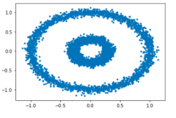
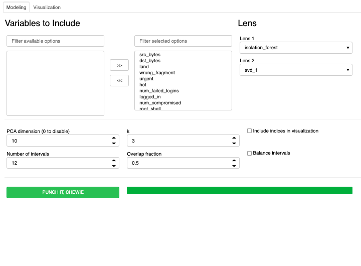

======
mugatu
======

.. image:: https://img.shields.io/pypi/v/mugatu.svg
        :target: https://pypi.python.org/pypi/mugatu

.. image:: https://img.shields.io/travis/jg10545/mugatu.svg
        :target: https://travis-ci.org/jg10545/mugatu

.. image:: https://readthedocs.org/projects/mugatu/badge/?version=latest
        :target: https://mugatu.readthedocs.io/en/latest/?badge=latest
        :alt: Documentation Status

Lightweight implementation of the Mapper algorithm for topological data analysis

* Free software: MIT license

What is this
------------

``mugatu`` is not a replacement for hardcore, flexible TDA tools like `giotto-tda <https://github.com/giotto-ai/giotto-tda>`_ and `scikit-tda <https://scikit-tda.org/>`_. This is only an implementation of the Mapper algorithm, and does not have their flexibility to wrap the entire ``scikit-learn`` API.

Since Mapper is largely a tool for telling stories with your data, I wanted to build

* Focus iteration on changes relevant to that storytelling task: more experimenting with different lenses, less experimenting with ``scikit-learn`` pipelines or DBSCAN parameters. The clustering step runs PCA then k-means. That's it. You can have one or two lenses at a time.
* Make those iterative steps as fast as possible. ``faiss`` is used for PCA and k-means, and the different clustering problems are parallelized with ``dask``.

None of my data structures are creative:

* Raw data should be prepared as a ``pandas`` DataFrame. The index of that DataFrame is used later to relate the nodes on the Mapper graph.
* Data for filtering and coloring should be in ``numpy`` arrays. If you're using the ``mugatu`` GUI, wrap them in a dictionary so they have an interpretable label.
* The Mapper graph is built by ``mugatu.build_mapper_graph()`` as a ``networkx`` Graph object. Do whatever you want with it.
* The ``mugatu.build_mapper_graph()`` function also returns a list of arrays giving the indices of raw data points associated with each node.

``mugatu`` also  provides an interactive GUI for experimenting with Mapper, written with the ``panel`` library and visualizing with ``holoviews``.

Wait, what's Mapper?
--------------------

Mapper is an algorithm that can be a useful addition to your unsupervised learning/visualization toolkit. While more common methods map high-dimensional point cloud data to categories (clustering), points on a unit simplex (mixture models, fuzzy clustering), or a low-dimensional point cloud (matix factorization, manifold learning), Mapper represents your data as a graph.

For example, Mapper converts this set of concentric-circle data (from my `example notebook <examples/sklearn_circles_example.ipynb>`_):

to a graph whose topology is consistent with our intuition for the dataset:

KDDCUP99 Example
----------------

The other example notebook is from the `kddcup99 dataset <https://kdd.ics.uci.edu/databases/kddcup99/task.html>`_ for network intrusion detection. From the ``mugatu`` GUI we can see that some of the common attack types cluster together easily on the graph: 

Credits
-------

This package was created with Cookiecutter_ and the `audreyr/cookiecutter-pypackage`_ project template.

.. _Cookiecutter: https://github.com/audreyr/cookiecutter
.. _`audreyr/cookiecutter-pypackage`: https://github.com/audreyr/cookiecutter-pypackage
